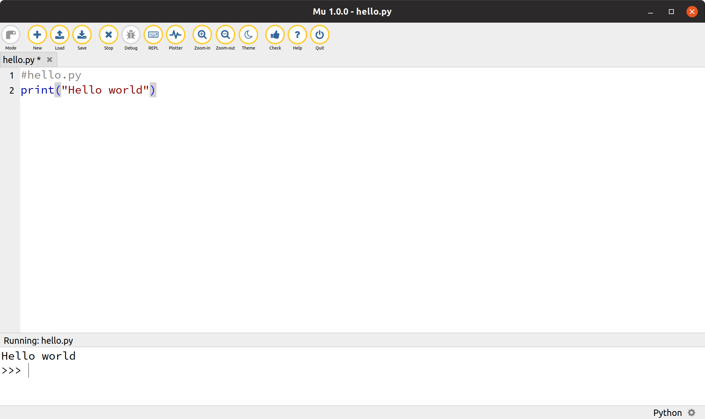
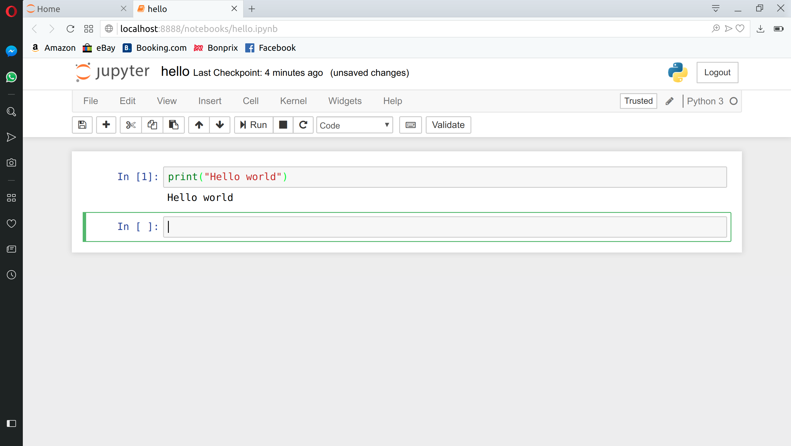

<style>
    body {
        background: white }
    section {
        background: white;
        color: black;
        border-radius: 1em;
        padding: 1em;
        position: absolute;
        top: 50%;
        left: 50%;
        margin-right: -50%;
        transform: translate(-50%, -50%) }
</style>
# Python basics

BB2441 

---

layout: false

# Python Basics


## Running

### Interactively

* `python` without arguments starts up  the Python interpreter 
* The interpreter reads lines one by one in the Python programming language and executes them
* The interpreter prints prompt `>>>` when it is waiting for input

~~~
$ python
>>> print("Hello world")
Hello world
>>>
~~~

* A read-evaluate-print-loop (REPL)
    - reads a Python expression
    - evaluates the expression
    - prints the value to the screen
    - starting over (loop)

---
### Running scripts

Assuming we have a file `hello.py` with content

~~~
#hello.py
print("Hello world")
~~~

we run the program from the command line with

~~~
$ python hello.py
Hello world
~~~

- --

In Linux:
~~~
#!/usr/bin/python
print("Hello world")
~~~
and the file is executable (`chmod +x`)and in your $PATH
~~~
$ hello.py
Hello world
~~~

The initial line `#!/usr/bin/python` tells the computer what program to use to
interpret the lines below

---

## Creating Python scripts

### Text editors

To enter code into files you need to use a text editor (not a word processor
like Microsoft Word). A text editor is good for programming if it automatically
colors special keywords for the programming language of that file. A simple 
editor that fulfills this is `nano`.


Developers survey on 
<a href="https://insights.stackoverflow.com/survey/2018/#development-environments-and-tools">
most popular programming editor
</a>: 
normally lists editors like vim, emacs, atom, sublime.
Spending time to learn one well is worth the investment.

---

### IDE:s

IDE = Integrated development environment

~~~
$ pip install mu-editor
$ mu-editor hello.py
~~~



---

### Notebooks

* work/develop in browser
* mix documentation and code
~~~
$ jupyter notebook
~~~

* good for exploration/experimentation/demonstration
* not good for writing large structured programs

---

<section>
Let us code
</section>

---

## Example

How long does it take to pay off a car loan given 

* prince 
* annual interest rate
* monthly payment

~~~
#car_loan.py
???
~~~


---
Version written during lecture (1/11)
~~~
#car_loan.py
import sys
print(sys.argv)

try:
    price = int(sys.argv[1])
    annual_rate = float(sys.argv[2])
    monthly = int(sys.argv[3])
except IndexError:
    print("Usage:", sys.argv[0], "price annual_rate monthly_payment")
    sys.exit(1)
    
#(1 + monthly_rate)**12*debt  = (1+ annual_rate)*debt 
monthly_rate = (1 + annual_rate)**(1/12) - 1

debt = price

month = 0
payments = []
while debt > 0:
    month = month + 1
    debt = debt*(1 + monthly_rate)
    debt = debt - monthly
    #print(month, debt)
    payments.append(debt)
    
print("Time to pay off car loan", month//12, "years", month%12, "months")
for p in payments:
    print(round(p,2))
~~~

---

Sample runs

~~~
python car_loan.py 
['car_loan.py']
Usage: car_loan.py price annual_rate monthly_payment
~~~

~~~
#; python car_loan.py 100000 .03 2000 | head
['car_loan.py', '100000', '.03', '2000']
Time to pay off car loan 4 years 6 months
98246.63
96488.93
94726.9
92960.52
91189.79
89414.68
87635.2
85851.34
...
~~~

The program fulfils basic requirements, 
but there is always room for improvement/polishing...

---

## Some Python types

Values in Python have a type
A type determines the range of possible values and operations that can be
performed

###  Numerical

* whole numbers (`int`): e.g. `-1, 7, 2000`
* decimal numbers (`float`): `3.14, 1.0 -7.25`
* complex numbers (`complex`): `1j, 7+5j`
* logical (`bool`): `True`, `False`

---

###  String: `str`

- sequence of characters
- literal strings are written within quotation marks
- single `'` and double `"` quotation marks have the same status
- three quotation marks limit strings that can span several lines


~~~
>>> print("It's time")
It's time
~~~


~~~
>>> print('Our boss is "nice". 😀')
Our boss is "nice". 😀
~~~

~~~
>>> print("""Hello
... world""")
Hello
world
~~~

---

## Variables

* To save the value of an object it is assigned to a *variable*
* The assignment operator is `=`
* Assignment is to bind a name to an object
* Python has so called free typing 

### Example
~~~
>>> x = 8*9
>>> print(x)
72
~~~

* Right-side is evaluated
* An `int` object with value 72 is created in memory
* An association is created with this object and the name `x`

---

## Container types

* Lists
* Tuples
* Dictionaries

---

### Lists

* A list is a ordered sequence of elements 
* Notation: square brackets , comma-separated
* List can have objects of different types
* List members are referenced with `[n]` where `n=0, 1, 2...`
* A list can be empty, `[]`

~~~
>>> colours = ['hearts', 'spades', 'diamonds', 'clubs']
>>> values = [2, 3, 4, 5, 6, 7, 8, 9, 10, 'knight', 'queen', 'king', 'ace']
~~~

---

### Tuples

* An immutable (unchangeable) sequence of objects
* Similar to lists
* () is the empty tuple
* (1,)  contains 1 element -note the comma

Handy packing and unpacking

```
>>> t = 1, 2 #packing
>>> x, y = t #unpacking
>>> x, y
(1, 2)
>>> x, y = y, x #swapping
>>> x, y
(2, 1)


```
---

### Dictionaries

* Sets of key-value pairs
* The key can be any immutable object
* Very useful for complex structures
* Efficient and highly optimized

```
empty =  {} # empty dict
newdict = {'a':1, 'b':2}
```

---

### Repetition (iteration, looping)

* The `for ... in` statement is used repeat the same operation for all elements of a
sequence

* A loop variable will reference the elements of the sequence, one at a time


```python
>>> for e in [1, 2, 3]: 
...    print(e)
1
2
3

```

```python
>>> for c in 'hello':
...     print(c)
h
e
l
l
o

```


```python
>>> for k, v in {'a': 1, 'b': 2}.items():                                       
...    print(k, v)
a 1
b 2

```


---

### Branching (if statements)

Conditional execution of code blocks depending on whether an expression
evaluates to True or not:

```
>>> if True:
...     print("Yes")
... else:
...     print("No")
Yes

```

```
>>> i = j = 0
>>> if i > j:
...     print(i, " is larger than ", j)
... else:
...     print(i, "is smaller than or equal to", j)
0 is smaller than or equal to 0

```

Most object types have some truthiness. Empty lists in a logical context
evaluate to False, non-empty to True

```
>>> if []:
...     print("Non-empty list")
... else:
...     print("Empty list")
Empty list

```

---


### Functions

* Functions are objects that can take some input and return some output.
Functions are the primary way of grouping code into independent units, that can be tested and reused

* Function definitions start `def`, a name,  parentheses with or without
arguments (comma-separated) and a colon.
The body of the function is indented with respect to the `def` keyword.
The last line of a function definition is normally a `return` statement and determines the value of a function call

```
>>> def square(x):
...    x2 = x * x
...    return x2

```

* Functions are called with function name and an actual parameter. 

```
>>> square(2)
4

```

* Inside the function the formal parameter `x` becomes a reference to the actual
parameter `2`.


---

### Modules


* a file with python source 
   - name is the filename without the ``.py`` extension
* `import` modules to reuse code
* members of module referenced with dot notation `module.member`

Commonly used Python modules

* ``sys``
* ``os``
* ``math``

---

#### `sys`

* system modules
* needed e.g. for arguments to a script
* `sys.argv` is a list of string arguments
* `sys.argv [0]` is the file name

~~~
import sys
infile = sys.argv[1]
~~~

#### `os`

* Interaction with operating system
* Example: execute a unix command 

```
    import os
    os.system('/bin/date')
```


#### `math`

* all basic elementary functions
* fundamental constants

```
    import math
    print(math.sin(math.pi/2))
```

#### Tip

Many use the math modules as a desktop calculator

    $ python
    >>> from math import *
    >>> print(pi/2)
    1.5707963267948966
    >>>

---

### Writing/using your own modules

* Suppose you have written file ``hello.py`` with function ``say_hello``

~~~
#hello.py
def say_hello():
    return "Hello world!"
~~~

* To access the same function in other code, import the module

~~~
>>> import hello
>>> message = hello.say_hello()
>>> print(message)
Hello world!
~~~


---

### Files

```
    >>> fo = open('foo', 'r')

```

* opens the file name for reading
* if is does not exist - Error
* returns a file object assigned to variable fo

```
    >>> file_str = fo.read()

```
* loads the contensts of the file to a string *file_str*

```
    >>> fo.close()

```
* close the file when done

---

### Reading text

Other ways to read a file into memory

* As a list of strings
```
    fo.readlines()
```
* One line at a time
```
    fo.readline() 
```
* In a for loop
```
    fo = open('file.txt') 
    for line in fo:
        *work on line*
```

The for statement is very powerful!
First example of iterator

---

### Summary

* Basic syntax - indentation
* Basic built in variable types
* Scalar and container types
* Modules
* Files

### Standard documentation
* https://docs.python.org/3

### On-line books
* Jake van der Plas: 
<a href="http://nbviewer.jupyter.org/github/jakevdp/WhirlwindTourOfPython/blob/master/Index.ipynb"> A Worldwind Tour of Python</a>
* Jake van der Plas: <a href="https://jakevdp.github.io/PythonDataScienceHandbook/">Data Science Handbook</a>
* Al Sweigart: <a href="https://automatetheboringstuff.com">Automate the Boring Stuff with Python</a>

### On-line tutorials
* https://docs.python.org/3/tutorial/
* https://realpython.com

